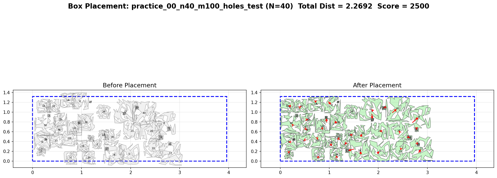

# 介绍

## 任务详细

[见任务书](docs/任务书/2026华为软件精英挑战赛决赛正式赛任务书V1.0.pdf)

# 代码提交
运行
```bash
python test_submit/merge.py
```
`src` 当中的多文件代码会被合并到  `src_merge/Solution.cpp` 当中

# 本地测试

```bash
python test_py/auto_test_and_vis.py
```
结果文件的可视化图输出到  `test_py/vis_output` 当中。


# 核心算法介绍

## 多阶段优化流程

整体管线按时间分阶段依次执行：

1. **排列 SA（saOnPerm）**：对多边形排列顺序做模拟退火，通过 shelf 布局评估排列代价，优化放置顺序
2. **AABB 回拉（aabbPullback）**：基于 AABB 碰撞检测，将各多边形沿朝原点方向二分回拉，快速收敛初始解
3. **NFP 矩阵构建（buildNFPMatrix）**：预计算所有多边形对的 NFP 及其网格索引，加速后续精确碰撞查询
4. **高温位置 SA（positionSAHigh）**：高温度大步长，周期退火，侧重全局搜索与消除重叠
5. **精确回拉（exactPullback mid）**：利用 NFP + 空间哈希做精确碰撞检测，多角度方向回拉
6. **低温位置 SA（positionSALow）**：低温度小步长精细调整，侧重局部优化
7. **精确回拉（exactPullback final）**：最终精细回拉，输出可行解

各阶段通过时间常量（`0.h`）严格分配时间预算，确保在限时时限内完成。

## 轨迹线法生成 NFP
### 代码贡献者()
### 轨迹线生成

基于两多边形顶点-边接触条件生成有向轨迹线段。对于多边形 B 的每个凸顶点，检查多边形 A 的各边方向角是否落在该顶点的法向锥内（`mayVertexTouchEdge`），若满足则生成一条轨迹线段；反之亦然。凹顶点处跳过，大幅减少无效线段数量。

### 外轮廓提取

从 y 坐标最低的轨迹线段出发，沿 `TraceSegmentGraph` 的交点链追踪。在每个交点处按参数 t 排序，选择最早的未访问分支前进，直至回到起点形成封闭外轮廓环。

### 孔洞提取

两种策略按轨迹线段数量自动切换：

- **遍历法**（小规模）：遍历所有向下方向线段作为内环起点，追踪提取内环
- **网格染色法**（中规模）：对轨迹线段网格进行连通域染色（`buildGridColor`），识别被轨迹线围成的封闭空腔，从空腔边界出发提取内环

两种方法均利用内环总转角为 -2π 判定是否为真正的内环，最终通过平移重叠测试剔除伪内环。

## 周期模拟退火组合优化
### 代码贡献者()

### move 算子

小幅随机位移，以一定概率偏向原点方向移动。后期采用扇形采样（fan sampling）在朝原点方向 ±60° 范围内随机取方向，增加方向多样性。碰壁时禁止越界方向分量。碰撞时若全局可行则利用 **MTV 滑动**（MTV slide）：沿 MTV 垂线方向滑移，贴着障碍物表面移动；若不可行则沿 **MTV 推开**（`+mtv * 1.001`）修正位置后重新验证。
这里 `AI` 在写代码时理解错了作者的意图，应该是：
仅当发现该多边形初始位置非法时，才使用 `MTV Push` 策略，而不是全局存在非法时走 `MTV Push`策略，赛后才发现 `AI` 写错了，不管了。

### swap 算子

交换两个多边形的中心位置，选择策略随进度变化：前期选距原点最远的多边形；中期按距离加权随机选取；后期按距离中位数筛选 + 尺寸匹配（面积比 > 0.6）。交换后若碰撞，对双方依次沿 MTV 反方向推开修正（`-mtv * 1.001`），先修正 ia 再检查 ib，两次修正后均无碰撞才按 SA 准则接受。

### jump 算子

大步长向原点方向扇形跳跃（±45°），跳距与当前距原点距离成比例（0.3~1.0 倍），用于跳出局部最优。跳跃后若碰撞，沿碰撞对象 MTV 方向推开修正（`+mtv * 1.001`），修正后无碰撞则按 SA 准则接受。

### random jump 算子

仅在存在非法多边形状态时触发，选取重叠惩罚最严重的多边形，执行全局随机跳跃（在可行域内随机采样目标点）或 MTV 方向局部跳跃。全局跳跃概率随进度从 0.6 衰减至 0.2。碰撞后同样沿 MTV 方向推开修正（`+mtv * 1.001`），无碰撞后按 SA 准则接受。当所有多边形都合法后，random jump 算子概率归0。
### 保证机制：
- 随机跳转操作显式设计来打破局部非法死锁
- 模拟退火的 `Metropolis` 准则允许接受更差解
- 多种操作类型（移动、交换、跳转）增加状态转移多样性
理论保证：在足够时间和适当参数下，可以保证破除局部死锁（包括非法死锁）

## 空间加速结构

- **SpatialHash**：均匀网格哈希，加速 SA 中候选多边形查找，支持动态插入/删除/重建
- **FastGrid**：64×64 扫描线网格，标记 NFP 内部/外部/边界/孔洞状态，加速 NFP 包含与重叠查询，同时缓存网格中心的最近的一条边索引来加速 MTV 计算。所以这是一个近似的 MTV，误差小于0.5倍的网格对角线。如果需要提高精度，可以每个格子存储最近的前 3 条边，以平衡效率和精度。

- **BVH**：层次包围盒树，加速点到 NFP 边界最近距离与 MTV 计算
- **XGrid**：X 方向一维网格索引，加速射线法点包含测试

## 可行域约束检测

**ContainPolys**：判断多边形平移后是否完全在可行域内。先做 AABB 快速排除，再通过 XGrid 加速射线法验证所有顶点在可行域内，最后通过边边交叉检测（`hasEdgeCrossing`）确认无越界穿透。由于比赛中时间紧张，没有使用速度更快 `O(1)` 但编程复杂度较高且容易出错的的 `IFP`, 后面会我们将会增加 `IFP` 计算逻辑。

## 其他关键技术

- **多边形膨胀容差**（`expandPolygon`）：对输入多边形做微小外扩（4e-5），采用斜接连接（miter join）并限制斜接比，避免因浮点误差导致的假阴性碰撞
- **凸包近似**：对顶点数 > 50 且包围盒面积占比 < 10% 的小而复杂多边形，用凸包替代以加速 NFP 计算
- **惩罚系数自适应**：周期退火每个周期起始时，若不可行则根据平均位移与平均 MTV 长度之比动态调整惩罚系数 C，确保重叠惩罚与目标函数量级匹配
- **循环退火**：高温 SA 采用周期退火策略，每周期重置温度与随机种子，避免陷入局部最优
